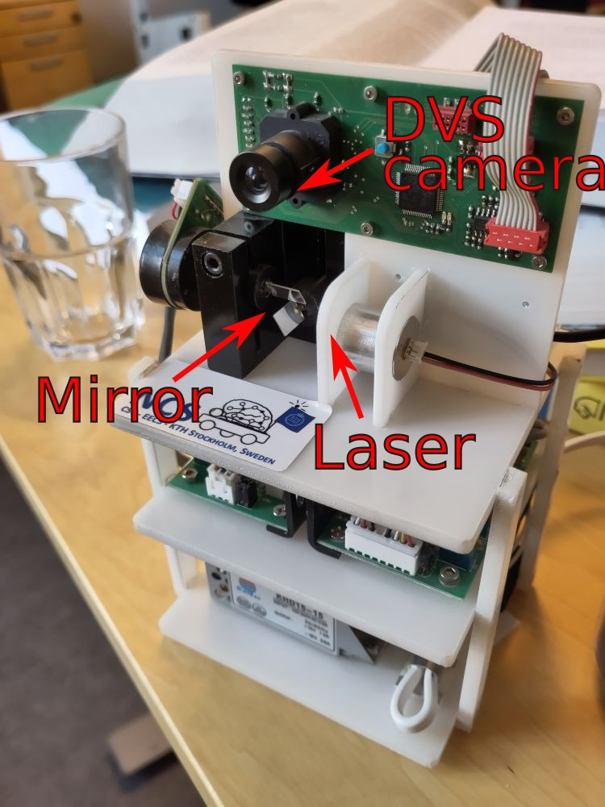

# Galvanic laser pointer control

This repo contains a small script `laser.py` that controls an ultra-fast galvanic mirror laser system.



To use, clone the directory and copy the script into whatever directory you need it.

The laser operates in $x \times y$ coordinate space, restricted to $(0, 800)$ in both directions.

## Usage: terminal
The script can either be used from the terminal, and controlled with the `wasd` keys.
Note that this **assumes the device is plugged in at `/dev/ttyUSB0`**.

```bash
> python3 laser.py
Connected to laser
```

## Usage: python
You can also use it in a python script like so:

```python
import laser
with laser.Laser() as l:
    l.on()
    l.move(0, 0)       # Upper left
    l.move(200, 200)
    l.move(800, 800)   # Bottom right
    l.move(1000, 1000) # No effect; out of bounds
    l.off()
```

## Acknowledgements

Developed by Jens E. Pedersen `<jeped@kth.se>`

[Neurocomputing Systems](https://neurocomputing.systems/) at KTH Royal Instititute of Technology